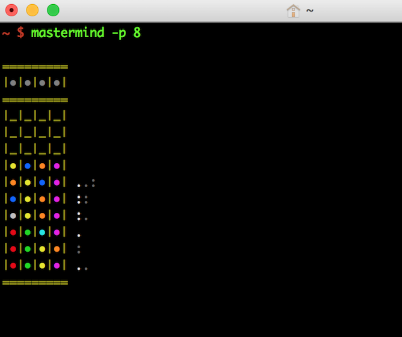
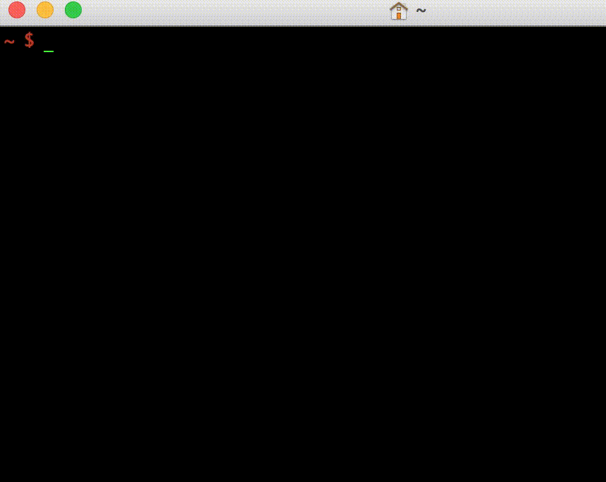

# Mastermind - Code breaking game

Command line implementation of the popular Mastermind game. Rules, key control and difficulty settings are explained in the help screen.



#### Gameplay


## Installation

#### macOS
```
brew tap codeliveroil/apps
brew install mastermind
```

#### Other
Download the [latest release](../../releases/latest) for your operating system and machine architecture. If one is not available, you can easily [compile from source](#compile-from-source).

## Usage
```
mastermind -help
```

## Compile from source

### Setup
1. Install [Go](https://golang.org/)
1. Clone this repository

### Build for your current platform
```
make
make install
```

### Cross compile for a different platform
1. Build
	```
	make platform
	```
1. Follow the prompts and select a platform
1. The binary will be available in the `build` folder
